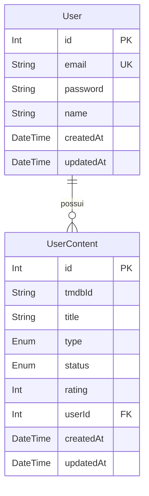

# Documentação de Banco de Dados

Esta seção detalha a modelagem relacional utilizada no projeto **StreamingCatalog**.

## DER (Diagrama Entidade-Relacionamento)



## Escolhas Arquiteturais
- **Prisma ORM**: Escolhido pela excelente integração com TypeScript, geração de tipos automática e facilidade em migrações.
- **Enums**: Utilizados para `ContentType` e `ContentStatus` para garantir consistência dos dados no nível do banco.
- **Unique Constraint**: A restrição `@@unique([userId, tmdbId])` impede que um usuário adicione o mesmo filme/série duas vezes à sua lista.

## Como Visualizar os Dados
Para uma verificação visual rápida, você pode rodar:
```bash
npx prisma studio
```
Isso abrirá uma interface web em `http://localhost:5555` onde você poderá navegar pelas tabelas e inserir dados de teste para validar a estrutura.
