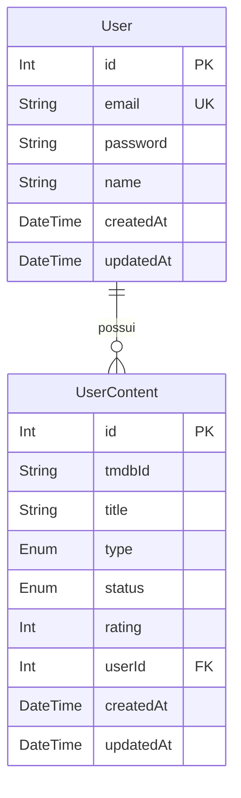

# Minha Modelagem de Banco de Dados

Este documento detalha como eu estruturei os dados do **StreamingCatalog** para garantir integridade e performance.

## Meu Diagrama Entidade-Relacionamento (DER)



## Minhas Decisões de Modelagem

### 1. Por que escolhi o Prisma?
Eu adotei o **Prisma ORM** pela sua tipagem forte e segurança em tempo de compilação. Isso me permitiu desenvolver muito mais rápido e com zero preocupações sobre erros de query em produção.

### 2. Uso de Enums
Eu utilizei Enums nativos para gerenciar os tipos de conteúdo (`MOVIE`, `TV`) e os estados da lista (`WATCHLIST`, `WATCHED`, `DROPPED`). Essa escolha garante que eu nunca tenha dados inválidos ou "strings soltas" no meu banco.

### 3. Integridade e Unicidade
Eu implementei uma constraint composta crucial no modelo `UserContent`:
`@@unique([userId, tmdbId, type], name: "userId_tmdbId_type")`

Fiz isso para garantir que um usuário nunca consiga adicionar o mesmo filme duas vezes. Ao usar o `type` na chave, eu permito flexibilidade caso o TMDb utilize IDs repetidos entre tipos diferentes (embora raro).

### 4. Gestão do Ciclo de Vida
Eu me certifiquei de que todas as conexões fossem encerradas corretamente ao destruir a aplicação (`OnModuleDestroy`), o que foi fundamental para manter a estabilidade no meu ambiente de testes.

## Como eu Visualizo os Dados
No dia a dia, eu utilizo o **Prisma Studio** para navegação visual:
```bash
npx prisma studio
```
Eu acesso a interface em `http://localhost:5555` sempre que preciso validar manualmente uma inserção ou ajuste na estrutura.
